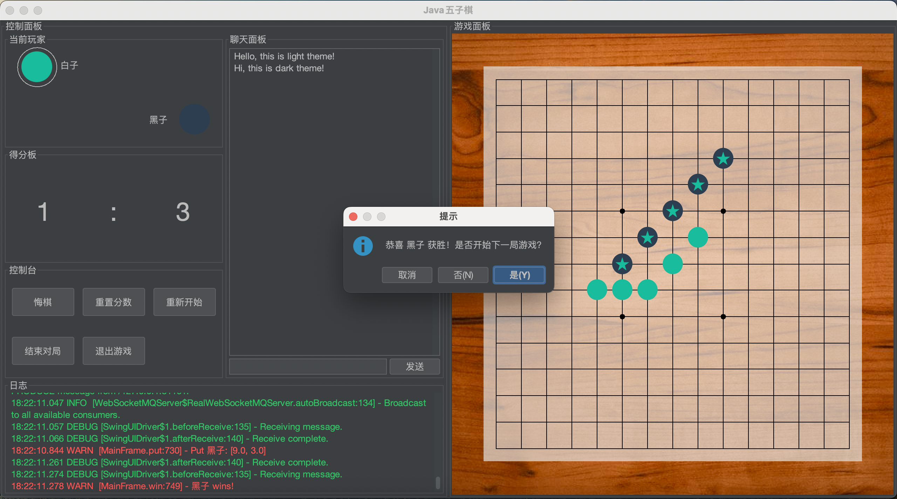
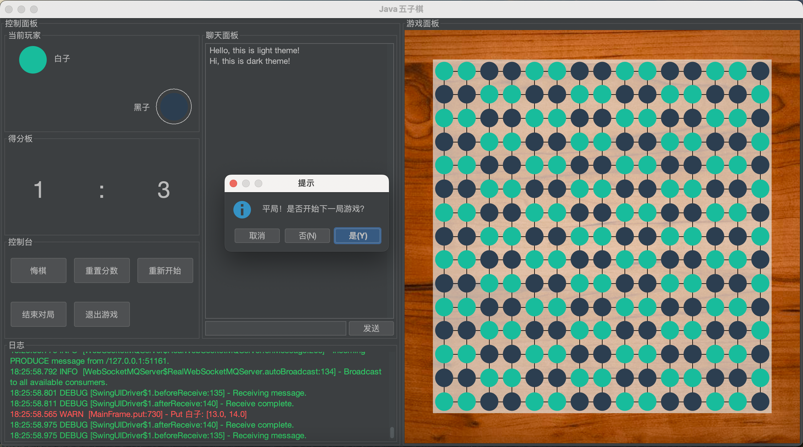
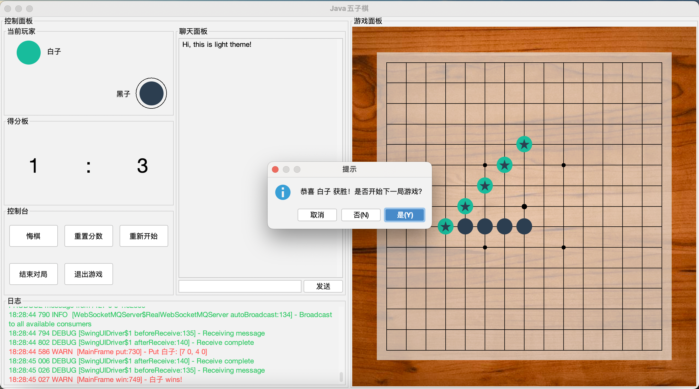
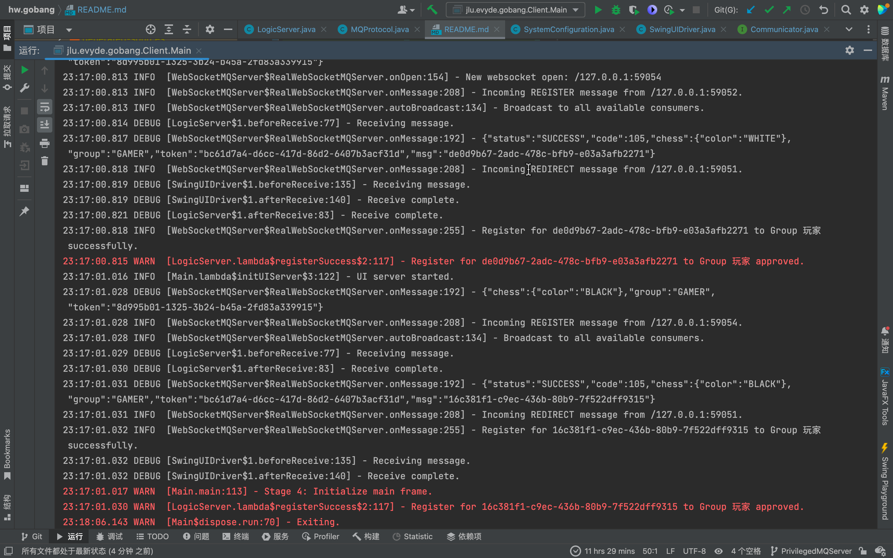

# 五子棋

对了，我又来写五子棋了（

打算写一个前后端分离的五子棋游戏。

是JLU的Java大作业。

项目使用MVC架构。

项目基本完成。

## 现阶段截图

https://user-images.githubusercontent.com/9302540/172889849-01f7e236-21ac-4a06-bfe1-85e3eea3e08f.mp4
https://github.com/Evyde/hw.gobang/blob/master/medias/Gobang1003.mp4?raw=true

## 功能

拟实现以下功能，具体实现哪些视情况而定：

- [X] 下棋
- [X] 设置
- [ ] AI
- [ ] 登录
- [X] 对战
- [ ] 动画（算是实现了个鼠标移动的动画）
- [X] 联机

- [X] i18n
- [X] 日志
- [X] 日间/夜间模式切换

## 客户端

客户端有两个阶段：

1. Java Native GUI体验阶段
2. Web前端阶段

总体来说，先用Java写一个基本的客户端出来，看时间再进行Web端的移植。

客户端和逻辑服务端使用Socket/WebSocket通信（方便后续移植）。

客户端架构分为三个部分，皆可独立启动：
1. Message Queue Server消息服务器，用于鉴权和推送消息
2. Logic Server逻辑服务器，用于判断UI操作是否合法，并执行游戏主逻辑
3. UI Server(UI Driver)图形界面服务，用于解析服务器传来的消息并对UI进行操作
4. UI Client图形界面客户端，用来处理用户点击事件、绘制棋子等

理论上，只要实现UI Driver和UI Client，便可与其他两个服务无缝衔接，示例见上述视频，UI更改自
[@MerlynAllen](https://github.com/MerlynAllen)的[gomoku-vue](https://github.com/MerlynAllen/gomoku-vue)，只对我的协议进行了适配，
可以看到已经取得了较为不错的效果。且适配工作十分简单。

通信暂时采用WebSocket，可能不会迁移到Socket了。

关于协议的描述，详见[Model/MQProtocol.java](Client/src/main/java/jlu/evyde/gobang/Client/Model/MQProtocol.java)和
[Model/MQMessage.java](Client/src/main/java/jlu/evyde/gobang/Client/Model/MQMessage.java)。

## 服务端

暂时没有服务端的想法，有也就是负责登录、传递对手的棋路、判赢、大厅聊天之类，要加的东西有很多。

简单的可以只加一个联机功能，复杂一些带登录、大厅，再复杂就可以加数据库了。

## 许可协议

本项目采用AGPLv3协议。
