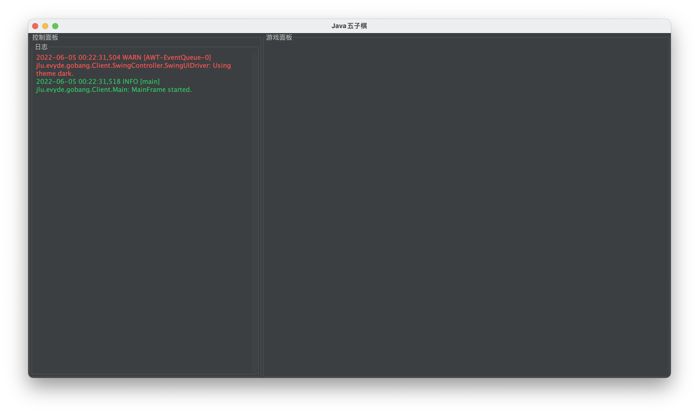
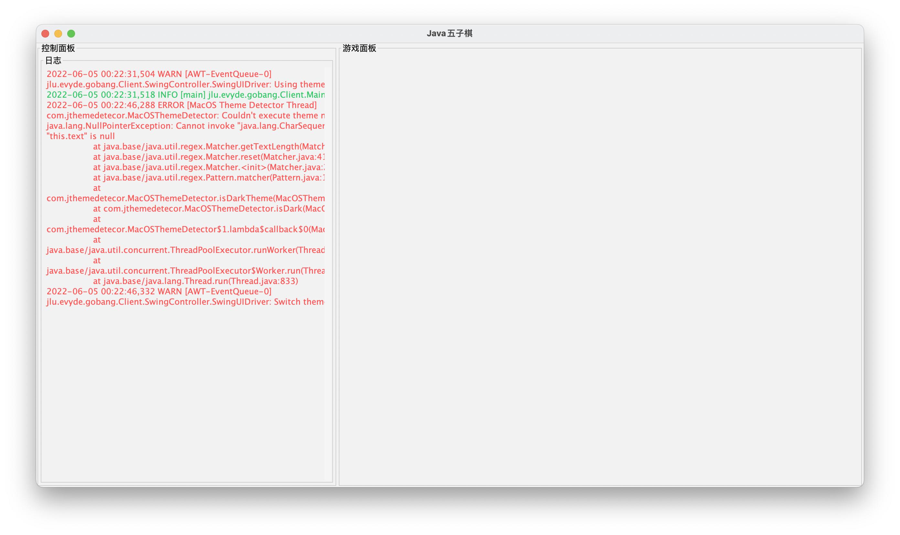

# 五子棋

对了，我又来写五子棋了（

打算写一个前后端分离的五子棋游戏。

是JLU的Java大作业。

项目使用MVC架构。

## 现阶段截图

## 功能

拟实现以下功能，具体实现哪些视情况而定：

- [ ] 下棋
- [ ] 设置
- [ ] AI
- [ ] 登录
- [ ] 对战
- [ ] 动画

- [X] i18n
- [X] 日志
- [X] 日间/夜间模式切换

## 客户端

客户端有两个阶段：

1. Java Native GUI体验阶段
2. Web前端阶段

总体来说，先用Java写一个基本的客户端出来，看时间再进行Web端的移植。

客户端和逻辑服务端使用Socket/WebSocket通信（方便后续移植）。

## 服务端

暂时没有服务端的想法，有也就是负责登录、传递对手的棋路、判赢、大厅聊天之类，要加的东西有很多。

简单的可以只加一个联机功能，复杂一些带登录、大厅，再复杂就可以加数据库了。

## 许可协议

本项目采用AGPLv3协议。